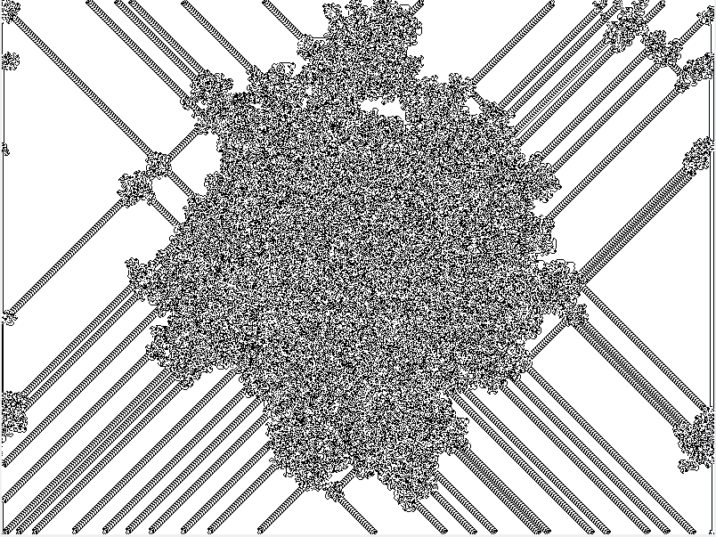

# Langton's Ant
Info --> https://en.wikipedia.org/wiki/Langton%27s_ant

Rules --> Squares on a plane are colored variously either black or white. We arbitrarily identify one square as the "ant". The ant can travel in any of the four cardinal directions at each step it takes. The "ant" moves according to the rules below:

   At a white square, turn 90° right, flip the color of the square, move forward one unit
    
   At a black square, turn 90° left, flip the color of the square, move forward one unit

